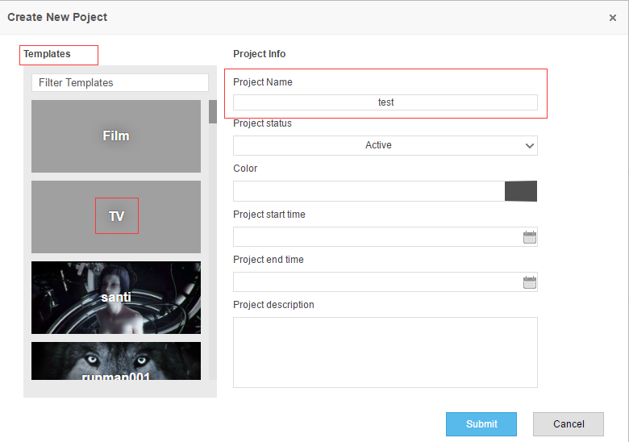

### Web创建项目
创建项目这么重要的事情，暂时没放到API里面，万一不小心放到循环里面弄出来百八十个项目，
boss肯定要找你聊天。所以还是现在Web上创建吧。

先登录Strack的web系统，选择创建项目，如下图所示，请填写项目名称，选择模板，选择项目颜色。

最后点击“创建”按钮，一个项目就创建好了，这时候记下项目的名字后，后面API中会用到，这里就
用上图中的“test”了。

这里简单讲下项目结构，Project下面有Episode和Sequence，这会根据Project Template变化，
TV模板下有Episode，Film模板下没有。

动画项目里面偶尔会用到“Stage”这个概念，在这里可以用Episode来代替使用。Sequence在
Episode下面是场次，Sequence下面有Shot，Shot下有Task。Asset直接在Project下面，
其下面也有Task。Asset可以链接到Shot上，表明某个Shot使用的assets。

>在本系统中Episode，Sequence，Shot，Asset，Task统称Entity。
