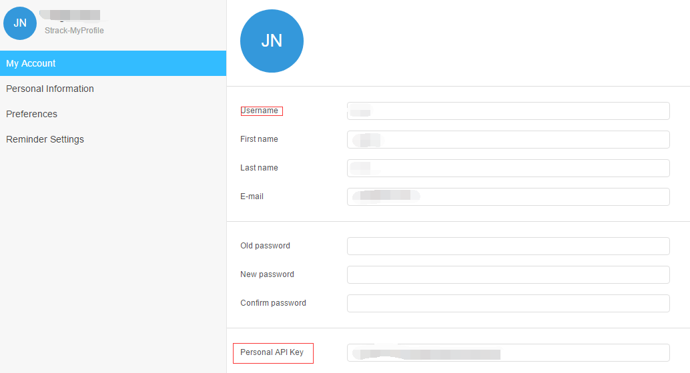

### API登录
Strack的API系统跟百度云，阿里云等主流API的登录类似，由用户名和API Key(秘钥)组成，秘钥
和用户的密码不一样。

#### 1. 获取API Key
**Strack**系统中每个用户在使用API时先要获取**API Key**，如下图所示：



记下自己的用户名login和**API Key**，以及**Strack**的url地址。下文中
**Strack**的url使用www.strack.com
用户名使用**test**
**API Key** 使用**3674decf73f7d060eb05b8410eddbed5**

#### 2. 加载**Strack**的API
有两种方法加载Strack的API：
* 直接将API的包拷贝到python的**Lib\site-packages**目录
* 使用sys.path加载，代码如下
    ```
    import sys
    sys.path.append(r"your strack api path")
    ```
>具体使用可以参考create_connect.py

#### 3. 登录**Strack**
首先要导入**Strack**的API,代码如下：

```
from strack_api.strack import Strack
```

本教程简单封装了下连接**Strack**的接口，代码如下：
```
def get_session(url, user, api_key):
    st = Strack(base_url=url,
                login=user,
                api_key=api_key)
    return st
```
url就是上面保存的**Strack**地址，user是用户的login用户名，api_key是保存下来的那串
字符，参数都是字符串格式。

>运行项目代码时，请修改create_connect.py中的base_url, user, key这三个变量。