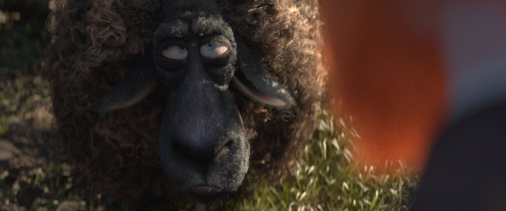
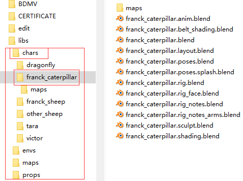
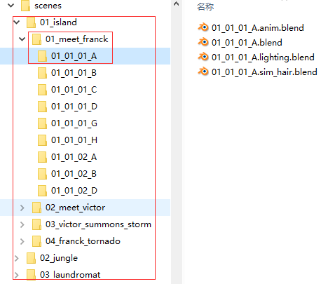

### 分析Cosmos Laundromat项目
这是Blender基金会的开源项目[传送门](https://cloud.blender.org/p/cosmos-laundromat/)

敢开源出来那肯定是有金刚钻的，整个项目组织的井井有条，下面来分析下我们关心的Asset和Shot部分。

#### 1. Asset目录结构
资产目录组织的很好，第一级算是asset的类别，第二级每个asset一个文件夹，当然也有按照类别来的，
第三级就是具体制作文件和贴图。为了看清楚上图。

图中chars, envs, maps, props就是asset的大类，以chars为例下面就有dragonfly，frank，
sheep等资产目录，内部是如图右边是具体的制作文件。

#### 2. Shot目录结构
shot是按照Stage->Sequence->shot这样的层级下来的，如下图：

有island，jungle，laundromat三个stage，下面的Sequence是按照内容来命名的，拿island
来说下面就有meet frank, meet victor, victor summons storm, frank tornado四个
Sequence。 下面的Shot命名采用"Stage编号_Sequence编号_镜头编号_标识字母"来命名。

分析完了项目的目录结构，就该动手整理下了，毕竟创建Asset和Shot是需要一张预览图片的。